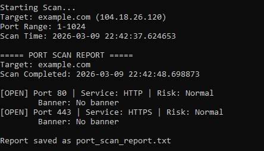
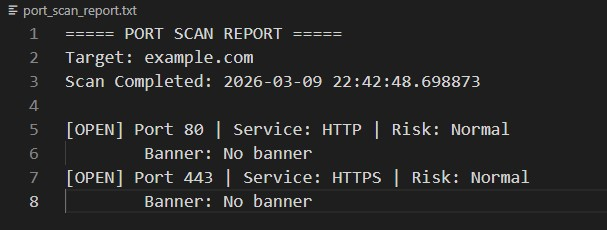

# Advanced TCP Port Scanner (Python)

A high-performance network reconnaissance tool developed in Python that performs concurrent port scanning, service identification, and risk-oriented reporting.
This project demonstrates practical knowledge of network security concepts, socket programming, and concurrent system design.


## Project Purpose

During security assessments and penetration testing engagements, identifying exposed network services is a critical first step.
This tool simulates that workflow by scanning a target host for open TCP ports and attempting to infer the services running on those ports.

The scanner was developed as a cybersecurity learning project focused on understanding:

* Network attack surface discovery
* Service fingerprinting techniques
* Secure system exposure analysis
* Performance optimization through multithreading
* Scan reporting and logging


## Core Capabilities

### Concurrent Port Scanning

Implements a threaded scanning architecture allowing multiple ports to be probed simultaneously.
This reduces scan time significantly compared to sequential approaches.

### Service Enumeration

Maps detected open ports to commonly associated services such as:
* HTTP
* SSH
* FTP
* DNS
* MySQL

This helps contextualize security risks.

### Banner Retrieval

Attempts to collect response banners from open services to assist with identification of software versions or protocols.

### Exposure Risk Indication
Ports commonly linked to sensitive infrastructure access (e.g., SSH or SMB) are highlighted to indicate potential attack vectors.

### Structured Scan Reporting

Generates a formatted text report summarizing findings including:

* Target host
* Scan timestamp
* List of open ports
* Service name
* Banner information
* Risk classification

## System Design Overview

The scanner operates through the following workflow:
1. Resolve the target hostname to an IP address
2. Populate a synchronized queue with the desired port range
3. Spawn worker threads that process ports in parallel
4. Attempt TCP connections with configurable timeouts
5. Collect and store scan results
6. Produce a final report for analysis. The report is saved to: `port_scan_report.txt`

This architecture demonstrates practical application of:
* socket-level networking
* concurrency control
* basic reconnaissance automation

## Project Structure
```
port_scanner/
│
├── port_scanner.py        # Main scanner implementation
├── port_scan_report.txt   # Generated report (after scan)
└── README.md              # Project documentation
```
## Technologies Used
Python Standard Libraries:

* socket — TCP connection handling
* threading — concurrent scanning
* queue — thread-safe port task management
* argparse — command-line argument parsing
* datetime — scan timestamp logging


No external dependencies are required.


## How the Scanner Works

The scanning process consists of several stages:

### 1. Target Resolution

The target hostname is converted into an IP address using:
```
socket.gethostbyname()
```
This allows the scanner to work with both IP addresses and domain names.


### 2. Port Queue Creation

A queue is populated with all ports in the specified range:
```
for port in range(start_port, end_port + 1):
    queue.put(port)
``` 
Each worker thread pulls ports from this queue.


### 3. Multithreaded Port Scanning

Multiple threads attempt TCP connections simultaneously:   
``` 
sock.connect_ex((target_ip, port))
```
If the connection succeeds (result == 0), the port is considered open.


### 4. Banner Grabbing

When a port is open, the scanner attempts to retrieve service banners:
```
sock.recv(1024)
```
This can reveal server software versions or protocols.

Example banners:
```
SSH-2.0-OpenSSH_8.4
220 FTP Server Ready
Apache/2.4.54
```

### 5. Risk Classification

Ports in the predefined list:
```
HIGH_RISK_PORTS = [21, 23, 445, 3389]
```
are labeled HIGH RISK because they often expose sensitive services.


### 6. Report Generation

After scanning completes, results are formatted into a readable report including:
```
Port
Service
Banner
Risk Level
```

## Example Output
Terminal output:
```
Starting Scan...
Target: example.com (104.18.26.120)
Port Range: 1-1024
Scan Time: 2026-03-09 22:42:37.624653

===== PORT SCAN REPORT =====
Target: example.com
Scan Completed: 2026-03-09 22:42:48.698873

[OPEN] Port 80 | Service: HTTP | Risk: Normal
        Banner: No banner
[OPEN] Port 443 | Service: HTTPS | Risk: Normal
        Banner: No banner
```        

Generated report:
```
===== PORT SCAN REPORT =====
Target: example.com
Scan Completed: 2026-03-09 22:42:48.698873

[OPEN] Port 80 | Service: HTTP | Risk: Normal
        Banner: No banner
[OPEN] Port 443 | Service: HTTPS | Risk: Normal
        Banner: No banner
```

## Screenshots





## Usage
Run the scanner from the terminal:
```
python port_scanner.py <target> --start <start_port> --end <end_port>
```
Example:
```
python port_scanner.py scanme.nmap.org --start 1 --end 1000
```
Scan a local machine:
```
python port_scanner.py 127.0.0.1 --start 1 --end 1024
```
## Performance

By distributing scan tasks across multiple threads, the scanner significantly reduces total scan time compared to sequential approaches.
Performance may vary depending on network latency, firewall behavior, and configured timeout values.

## Security & Ethical Use

This tool is intended strictly for:
* Cybersecurity education
* Authorized penetration testing labs
* Defensive network auditing

Scanning networks without permission may violate laws or institutional policies.
Users are responsible for ensuring ethical use.


## Learning Objectives

This project helps develop understanding of:
* Network reconnaissance fundamentals
* Concurrent programming strategies
* Service fingerprinting concepts
* Exposure risk awareness
* Automation of security assessment tasks


## Author

Developed as part of a cybersecurity learning portfolio to gain practical experience with network scanning methodologies and system exposure analysis.

## License

This project is provided for educational purposes.
Users are encouraged to modify and extend the tool for personal learning in authorized environments.

